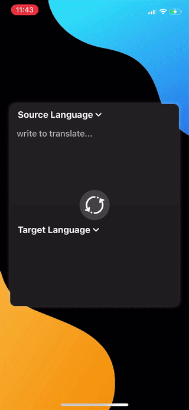

## HMS ML Kit - Translation

## Table of Contents

 * [Introduction](#introduction)
 * [Getting Started](#getting-started)
 * [Supported Environments](#supported-environments)
 * [Installation](#installation)
 * [Sample Code](#sample-code)
 * [Result](#result)

## Introduction
HUAWEI ML Kit allows your apps to easily leverage Huawei's long-term proven expertise in machine learning to support diverse artificial intelligence (AI) applications throughout a wide range of industries. Thanks to Huawei's technology accumulation, ML Kit provides diversified leading machine learning capabilities that are easy to use, helping you develop various AI apps.

The real-time translation service can translate text from the source language into the target language through the server on the cloud. Currently, real-time translation supports 40 languages. For details, please refer to [Languages Supported by Translation](https://developer.huawei.com/consumer/en/doc/development/HMSCore-Guides-V5/ml-resource-0000001050038188-V5).
Please refer here to check [other features of ML Kit](https://developer.huawei.com/consumer/en/doc/development/HMSCore-Guides-V5/service-introduction-0000001050040017-V5).

--> This project is a demo app that uses HMS ML Kit's Real-Time Translation feature to translate text as you type.

## Getting Started

* You need to import <b>agconnect-services.plist</b> file to run the project correctly.
* If you don't have a Huawei Developer account, check <a href="https://developer.huawei.com/consumer/en/doc/start/10104" target="_blank">this document</a> to create a new one.
* <a href="https://developer.huawei.com/consumer/en/console" target="_blank">Login</a> to Huawei Developer Console.
* If you don't have a project and app, check <a href="https://developer.huawei.com/consumer/en/doc/distribution/app/agc-create_app" target="_blank">this document</a> to learn how to create.
* Go to <b>My Projects</b> and select your project that you were created. And click <b>Project Settings</b> then go to <b>Manage APIs</b> page to nable necessary SDKs.
* For this project you have to set enable ML Kit.
* Then return to <b>Project Settings</b> page and download <b>agconnect-services.plist</b> file.
* Move the configuration file into your project, below Info.plist file.

## Supported Environments

* You need a Mac with Xcode 11 or later installed.
* You need Cocoapods to install libraries.
* ML Kit is supported for devices with iOS 9.0 or later.  But for this project, you need a device with iOS 13.0 or later.

## Installation

To integrate Real-Time Translation Service, you must complete the following preparations:
*   Create an Xcode project.
*   Create the Podfile, and add necessary framework(s).

Edit the Podfile.

Add the pod on which the AppGallery Connect and Real-Time Translation services depend.

    pod 'AGConnectCore'
    pod 'MLTranslate'

And run `pod install` command.

## Sample Code

Getting all supported languages, use *MLTranslateLanguage.getCloudAllLanguages()* method:

    MLTranslateLanguage.getCloudAllLanguages({ allLangs in
        print(allLangs)
    }, addOnFailureListener: { exception in
        print("exception on getCloudAllLanguages: \(exception)")
    })

Setting *source* and *target* languages for real-time translation:

    let settings = MLRemoteTranslateSetting(sourceLangCode: "en", targetLangCode: "tr")
    MLRemoteTranslator.sharedInstance().setRemoteTranslator(settings)
    

To translate text asynchronously use *MLRemoteTranslator.sharedInstance().asyncTranslate()* method:

    let settings = MLRemoteTranslateSetting(sourceLangCode: "en", targetLangCode: "tr")
    MLRemoteTranslator.sharedInstance().setRemoteTranslator(settings)

## Result
<table>
<tr>
<td>
   
</td>
</tr>
</table>

